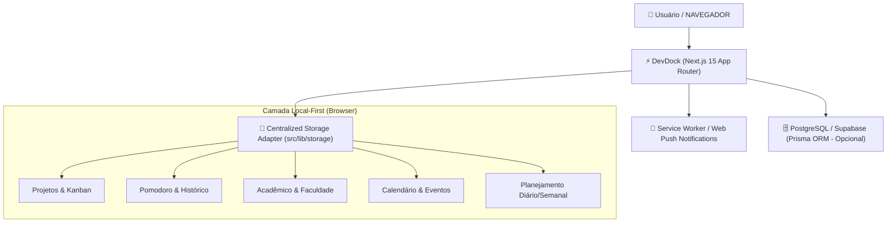

# Arquitetura do Sistema — DevDock

> **Status:** Implementado

## Visão Geral

O **DevDock** é uma plataforma profissional local-first de foco, produtividade e organização integrada. Ele reúne temporizador Pomodoro & Cronômetro, gerenciamento de projetos com Kanban interativo, planejamento diário/semanal, controle acadêmico de disciplinas e avaliações, calendário unificado, relatórios de desempenho e suporte PWA com Web Push Notifications.



---

## Tech Stack Oficial

Baseada no [`package.json`](../package.json):

- **Core**: Next.js `15.1.0` (App Router, React `19.0.0`, Node.js)
- **Linguagem**: TypeScript `5.4.5`
- **Estilização**: Tailwind CSS `3.4.1` (Design System Monocromático de 10 Tons com suporte a Dark/Light/Sistema)
- **Ícones**: Lucide React `0.469.0`
- **Interatividade & Drag and Drop**: `@dnd-kit/core`, `@dnd-kit/sortable`, `@dnd-kit/utilities`
- **Autenticação**: NextAuth.js `4.24.15` (Credentials & Google OAuth 2.0)
- **Notificações**: Notification API + Web Push API (`web-push 3.6.7`) + Service Worker
- **Banco de Dados & ORM**: PostgreSQL (Supabase) + Prisma ORM `6.19.3`
- **Validação**: Zod `4.4.3`

---

## Estrutura de Diretórios

```text
src/
├── app/                  # Rotas e páginas do Next.js App Router (24 rotas)
│   ├── actions/          # Server Actions (Notificações, Pomodoro, Cloud Sync)
│   ├── api/              # API Routes (NextAuth.js, Push Subscriptions)
│   ├── calendario/       # Módulo Calendário
│   ├── configuracoes/    # Configurações de Tema, PWA e Notificações
│   ├── estudos/          # Módulo de Estudos, Matérias e Faculdade
│   ├── planejamento/     # Planejamento Diário e Semanal
│   ├── pomodoro/         # Pomodoro Timer & Cronômetro
│   ├── projetos/         # Gerenciamento de Projetos & Kanban
│   ├── relatorios/       # Relatórios de Produtividade
│   ├── error.tsx         # Boundary de Erro de Segmento
│   ├── global-error.tsx  # Boundary Global de Erro
│   ├── loading.tsx       # Skeleton de Carregamento de Rota
│   └── page.tsx          # Painel Dashboard 360°
├── components/           # Componentes UI organizados por domínio
│   ├── academic/         # Modais e cartões acadêmicos
│   ├── backup/           # Modais de Exportação, Importação e Restauração
│   ├── calendar/         # Visualizadores e modais de calendário
│   ├── kanban/           # Cartões e colunas arrastáveis (SortableKanbanCard)
│   ├── layout/           # MainLayout e Sidebar responsiva
│   ├── planning/         # Tabelas de planejamento
│   ├── projects/         # Modais de projetos
│   ├── pwa/              # Banners de instalação PWA
│   ├── reports/          # Gráficos nativos em CSS/SVG
│   ├── ui/               # EmptyState, ErrorState, Skeletons
│   └── studies/          # Modais de tópicos e matérias
├── context/              # Contextos globais (ThemeContext, AuthContext)
├── hooks/                # 9 Domain Custom Hooks (useProjects, usePomodoroTimer, etc.)
├── lib/                  # Camada de infraestrutura e utilitários
│   ├── backup/           # Motor de backup (export, restore, validation)
│   ├── date/             # Manipulação precisa de datas civis e timezones
│   ├── storage/          # StorageAdapter tipado e sincronização multi-aba
│   └── sync/             # Sincronização em nuvem
└── types/                # Definições de tipo estritas (8 domínios)
```

---

## Gerenciamento de Estado e Sincronização Multi-Aba

O DevDock adota uma arquitetura **Local-First Reativa**:

1. **Leitura/Escrita**: Todas as operações de leitura e gravação acontecem através do `storageAdapter` ([`src/lib/storage/adapter.ts`](../src/lib/storage/adapter.ts)), isolando acessos ao `localStorage`.
2. **Sincronização Reativa**: O `storageAdapter` dispara eventos `devdock-storage-update` na mesma janela e o navegador dispara eventos `storage` entre abas.
3. **Reatividade Instantânea**: O hook [`useStorageSync`](../src/lib/storage/sync.ts) escuta esses eventos e atualiza os hooks de domínio instantaneamente sem recarregar a página (`F5`).
