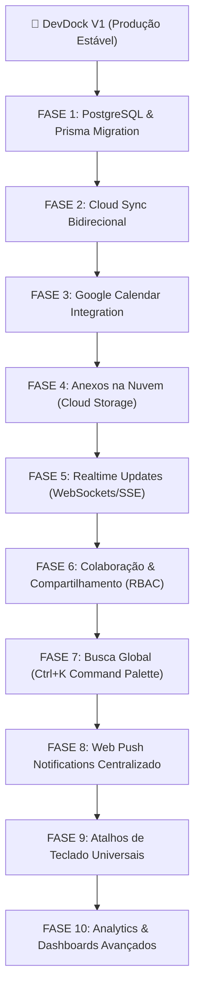

# DEVDOCK V2 — PLANO DE ARQUITETURA E ROADMAP PÓS-DEPLOY

> **Status do Documento:** Planejamento e Especificação Oficial  
> **Diretriz de Execução:** Execução SOMENTE após a V1 estar 100% publicada, testada e estabilizada em produção.

---

## 🎯 Visão Geral da V2

O **DevDock V2** transformará a plataforma de um produto local-first/pessoal em um ecossistema **multi-dispositivo**, **sincronizado em nuvem**, **colaborativo** e **integrado**.

---

## 🗺️ Roadmap de Implementação por Fases

---

## 📋 Detalhamento Técnico das Fases da V2

### FASE 1: PostgreSQL & Prisma Migration
- **Infraestrutura**: Migração do schema local-first (`storageAdapter`) para tabelas relacionais em PostgreSQL (Supabase).
- **Mapeamento de Entidades**: `User`, `Project`, `ProjectTask`, `ProjectNote`, `Task`, `CalendarEvent`, `AcademicSubject`, `AcademicAssignment`, `AcademicLink`, `AcademicAttachmentFile`, `Category`, `PomodoroSession`.
- **Estratégia de Migração**: Importador automático `DevDock Backup JSON` $\rightarrow$ tabelas do banco no primeiro login do usuário.

### FASE 2: Cloud Sync Bidirecional
- **Fluxo**: PC $\leftrightarrow$ Cloud Database $\leftrightarrow$ Celular/PWA.
- **Resolução de Conflitos**: Timestamp de modificação (`updatedAt`) com mesclagem não-destrutiva (Optimistic Concurrency Control).
- **Indicador no UI**: Badge em tempo real no Header (`● Sincronizado`, `⟳ Sincronizando...`, `⚠ Offline`).

### FASE 3: Integração com Google Calendar
- **Autenticação**: Google OAuth 2.0 com escopo `https://www.googleapis.com/auth/calendar.events`.
- **Funcionalidades**: Sincronização bidirecional de avaliações acadêmicas, prazos de tarefas e entregas diretamente no calendário do usuário.
- **Segurança**: Armazenamento encriptado de Tokens e Refresh Tokens na tabela `Account` via Server Actions.

### FASE 4: Storage de Anexos na Nuvem
- **Arquitetura**: Upload direto via Presigned URLs (S3 / Supabase Storage).
- **Banco de Dados**: Metadados (nome, tamanho, mimeType, URL, `userId`, `subjectId`, `assignmentId`, `projectId`) salvos no PostgreSQL.
- **Formatos**: PDF, DOCX, PPTX, XLSX, TXT, ZIP, Imagens.

### FASE 5: Sincronização em Tempo Real (Realtime)
- **Tecnologia**: WebSockets / Server-Sent Events (SSE) via Supabase Realtime / Socket.io.
- **Experiência**: Alterações efetuadas no PC refletem instantaneamente na tela do celular sem necessidade de refresh (`F5`).

### FASE 6: Colaboração & Compartilhamento de Projetos
- **Permissões (RBAC)**:
  - `Viewer`: Visualização de Kanban, notas e timeline.
  - `Commenter`: Adição de notas e comentários.
  - `Editor`: Edição de tarefas e checklists.
  - `Admin`: Gestão de membros e exclusão.
- **Isolamento**: Validação estrita no servidor (Server Actions / Middleware) garantindo que nenhum usuário acesse projetos não autorizados.

### FASE 7: Busca Global (`Ctrl` / `Cmd` + `K`)
- **Interface**: Palette modal ativado via atalho `Ctrl+K`.
- **Abrangência**: Pesquisa unificada em Tarefas, Projetos, Notas, Matérias, Avaliações, Links, Arquivos e Sessões de Foco.

### FASE 8: Web Push Centralizado
- **Arquitetura**: Agendamento de push via Server Worker / Cron Job.
- **Casos de Uso**: Lembretes de avaliações prestes a vencer, término de timer Pomodoro, tarefas diárias pendentes.

### FASE 9: Atalhos de Teclado Universais
- `Ctrl + K`: Busca Global
- `N`: Nova Tarefa
- `P`: Ir para o Pomodoro
- `C`: Ir para o Calendário
- `Esc`: Fechar modais ativos

### FASE 10: Analytics Avançado
- Métricas de produtividade por matéria, categoria e projeto.
- Gráficos de evolução temporal de horas de foco acumuladas.

---

## 🔒 Critérios de Segurança e Qualidade para Ativação da V2

1. **Deploy da V1 Concluído**: V1 publicada e rodando em produção sem falhas.
2. **Quality Gate Estável**:
   - `npm run lint` $\rightarrow$ 0 erros
   - `npx tsc --noEmit` $\rightarrow$ 0 erros
   - `npm test` $\rightarrow$ 16/16 testes aprovados
   - `npm run build` $\rightarrow$ 34/34 páginas estáticas geradas
